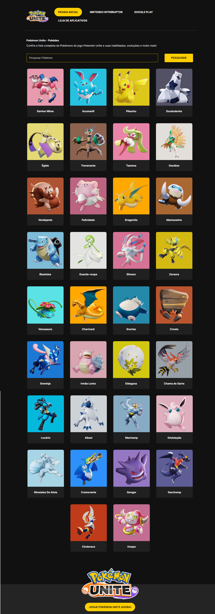

# Pokémon Unite - Pokédex

## Visão Geral

 [Vizualizar](https://pokemon-unite-eduzz.vercel.app/)
<details>
  <summary>📸</summary>
  
  

</details>

## Descrição do Projeto

Este projeto é uma Pokédex interativa para o jogo Pokémon Unite, onde os jogadores podem explorar informações detalhadas sobre os Pokémon disponíveis no jogo, incluindo habilidades, evoluções e mais.

## Funcionalidades

- Lista completa de Pokémon disponíveis em Pokémon Unite.
- Detalhes de cada Pokémon, incluindo nome, tipo(s), habilidades e estatísticas.
- Funcionalidade de pesquisa para encontrar Pokémon específicos.
- Interface responsiva para uso em dispositivos móveis e desktops.
- Integração com API para dados atualizados e precisos.

## Instalação e Uso

1. **Clone o repositório:**

   ```bash
   git clone https://github.com/seu-usuario/seu-repositorio.git
   cd seu-repositorio

2. **Instale as dependências:**

   ```bash
   npm install

3. **Inicie o servidor de desenvolvimento:**

   ```bash
   npm start
   
4. **Abra o navegador e acesse:**

   ```bash
   http://localhost:3000


## Como Contribuir

Se você deseja contribuir para este projeto, siga os passos abaixo:

1. Faça um fork deste repositório.
2. Crie uma branch para sua feature (`git checkout -b feature/sua-feature`).
3. Commit suas mudanças (`git commit -am 'Adiciona nova feature'`).
4. Faça um push para a branch (`git push origin feature/sua-feature`).
5. Crie um Pull Request.


